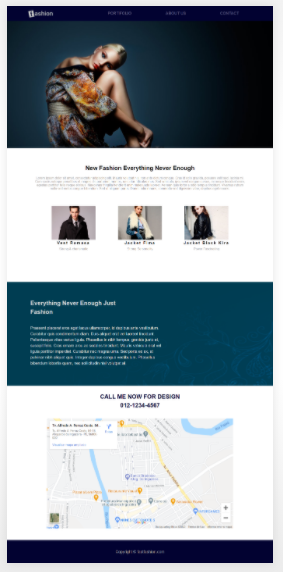
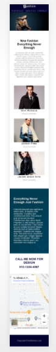

# pagina-fashion

Página inicial desenvolvida durante o curso Curso Web Design Completo: HTML5, CSS3 e JS + 5 Projetos da Udemy

---

- Sobre

Foi desenvolvida uma página totalmente responsiva, usando media query com mobile first.

---

- Tecnologias Utilizadas
  - HTML
  - CSS
    - Media Query

---

- Resultado
  O resultado obtido está mostrado nas figuras a seguir.

Versão desktop

<h1 align="center">
  
</h1>

Versão mobile

<h1 align="center">
  
</h1>
